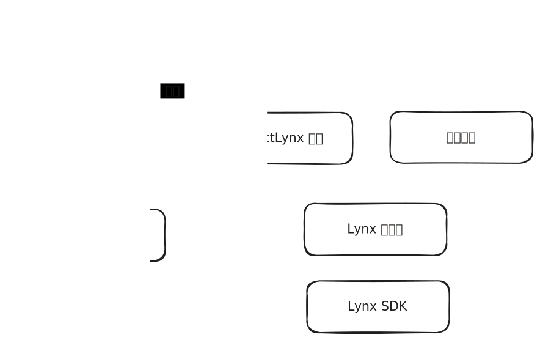

# 开发者体验

### Getting Started

```bash
# 准备环境
安装 node.js 18.19 

# Q: 为什么需要 node.js? 
# A: 我猜是 rspeedy 的需求？

# 创建前端项目
npm create rspeedy@latest
    # Config your project, including name, JS or TS, linter options. 

cd <project-name>

npm install

npm run dev
# 调用 rspeedy，使用它的大包功能，将前端代码[*]大包成一个二进制文件。屏幕上出现一个二维码。
# TODO: 用一张图描述 hot reload 的原理
```

设备安装 Lynx Explorer。类似于 Expo，可以直接扫码，来运行 JS 代码。

```bash
# 我选择使用 iOS 模拟器
# 1. 下载 https://github.com/lynx-family/lynx/releases/latest/download/LynxExplorer-arm64.app.tar.gz 并解压
# 2. Mac 打开 Simulators.app (等待几分钟) 
# 3. 将 LynxExplorer-arm64.app 拖拽进 Simulator 进行安装 (学到了新知识!)
# 4. 将 URL 复制进 LynxExplorer 的文字窗口，点击 Go。
# 注意：如果 URL 输入错误，比如最前面多打 $ 会导致白屏。应该增加一个 URL 错误提示窗口。
```


以上就启动了 Getting Started app 自带的代码。之后就可以修改代码了！保存文件之后，app 会马上刷新。


深入研究：Getting Started 项目里面，有哪些文件呢？

```

├── README.md
├── dist               # 构建产物
├── lynx.config.ts     # ⭐️
├── node_modules       # 运行 npm install 产生的依赖
├── package-lock.json  # 运行 npm install 产生的文件
├── package.json       # ⭐️
├── src
│   ├── App.css
│   ├── App.tsx
│   ├── assets
│   │   ├── arrow.png
│   │   ├── lynx-logo.png
│   │   └── react-logo.png
│   ├── index.tsx
│   └── rspeedy-env.d.ts
└── tsconfig.json      
```


深入研究：如果用浏览器访问这个 URL，会得到什么呢？

会下载一个类型不明的文件。应该是 Lynx 自定义的文件格式，应该可以被 Lynx SDK 解析。用 text editor 打开会看到，最开始是乱码，后面是类似 JavaScript 的语法。看起来是某些产物打包到一起。

如果分析前端构建产物，会看到：

```
$ cd dist && tree -a
.
├── .rspeedy
│   ├── main
│   │   ├── background.js
│   │   ├── background.js.map
│   │   ├── debug-info.json
│   │   ├── main.css    
│   │   ├── main.css.hot-update.json
│   │   └── tasm.json
│   └── main__main-thread
│       ├── main-thread.js
│       └── main-thread.js.map
├── main.lynx.bundle
└── static
    └── image
        ├── arrow.aee54ba7.png
        ├── lynx-logo.620eb8d1.png
        └── react-logo.75eb3837.png
```





### 其他

Q: 需要用到哪些语言？

Q: 需要用到哪些工具 (IDE/Debug tools)？
