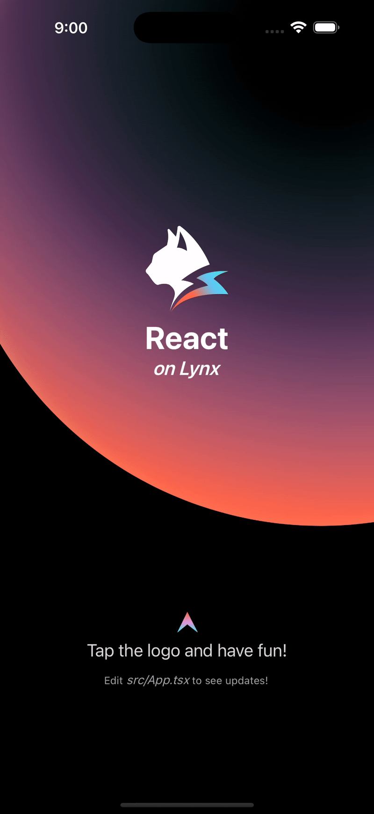

# 快速上手

### Getting Started

```bash
# 准备环境
安装 node.js 18.19 

# Q: 为什么需要 node.js? 
# A: 我猜是 rspeedy 的需求？

# 创建前端项目
npm create rspeedy@latest
    # Config your project, including name, JS or TS, linter options. 

cd <project-name>

npm install

npm run dev
# 调用 rspeedy，使用它的大包功能，将前端代码[*]大包成一个二进制文件。屏幕上出现一个二维码。
# TODO: 用一张图描述 hot reload 的原理
```

设备安装 Lynx Explorer。类似于 Expo，可以直接扫码，来运行 JS 代码。

```bash
# 我选择使用 iOS 模拟器
# 1. 下载 https://github.com/lynx-family/lynx/releases/latest/download/LynxExplorer-arm64.app.tar.gz 并解压
# 2. Mac 打开 Simulators.app (等待几分钟) 
# 3. 将 LynxExplorer-arm64.app 拖拽进 Simulator 进行安装 (学到了新知识!)
# 4. 将 URL 复制进 LynxExplorer 的文字窗口，点击 Go。
# 注意：如果 URL 输入错误，比如最前面多打 $ 会导致白屏。应该增加一个 URL 错误提示窗口。
```


以上就启动了 Getting Started app 自带的代码。之后就可以修改代码了！保存文件之后，app 会马上刷新。

<div align="center"><figure><figcaption></figcaption></figure></div>

上图看起来很有质感，它展示了哪些 UI 元素呢？

* 背景图：CSS 属性 `background: radial-gradient 和 box-shadow`
* Logo：动画效果 (`CSS keyframe animation`) + 点击可切换。
* 标题：
* 图片（箭头）
* 文字：文字属性（字号、颜色、斜体）
* 布局方法：flex


深入研究：Getting Started 项目里面，有哪些文件呢？

```

├── README.md
├── dist               # 构建产物 (在 dist/ 下面是构建工具的约定)
├── lynx.config.ts     # Lynx 配置文件，执导如何构建 Lynx 项目 ⭐️
├── node_modules       # 运行 npm install 产生的依赖
├── package-lock.json  # 运行 npm install 产生的文件
├── package.json       # NPM 配置文件 ⭐️
├── src                # 主要的 JS/TS 代码
│   ├── App.css        # 主要 App 的 CSS 样式
│   ├── App.tsx        # 主要 App 的 React Component
│   ├── assets
│   │   ├── arrow.png
│   │   ├── lynx-logo.png
│   │   └── react-logo.png
│   ├── index.tsx
│   └── rspeedy-env.d.ts
└── tsconfig.json      
```

细节详见 [da-bao-gong-ju-he-chan-wu.md](kua-ping-tai-ui-kai-fa/da-bao-gong-ju-he-chan-wu.md "mention")。

